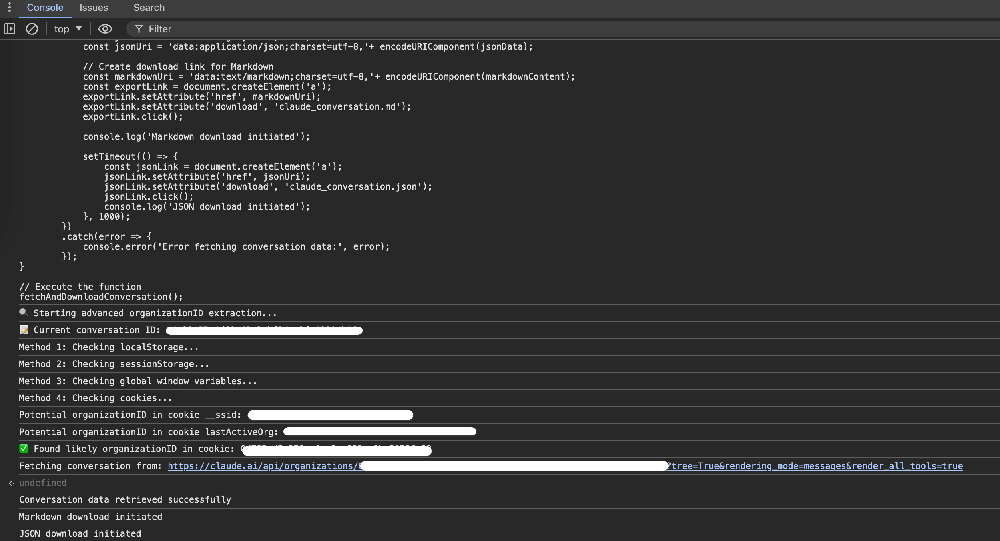

# Claude Conversation Exporter

A JavaScript utility to export your Claude AI conversations as Markdown and JSON files, including all attachments, artifacts, and their extracted content.

## Notes

- This script was tested on May 21, 2025
- The script runs entirely in your browser and doesn't send your data to any third-party servers
- If the organization ID cannot be automatically detected, the script will prompt you to enter it manually
- Some very large conversations might have truncated content in certain sections

## What This Script Does

This script allows you to:
- Export the current Claude conversation you're viewing in your browser
- Download both Markdown (.md) and JSON (.json) versions of the conversation
- Include all message content, including:
  - Regular text messages
  - Claude's "thinking" sections
  - Tool usage and results
  - File attachments, artifacts, and their extracted content

## How to Use

1. Open a Claude conversation in your web browser that you want to export
2. Open your browser's developer console:
   - Chrome/Edge: Press F12 or Ctrl+Shift+J (Windows/Linux) or Cmd+Option+J (Mac)
   - Firefox: Press F12 or Ctrl+Shift+K (Windows/Linux) or Cmd+Option+K (Mac)
3. Copy the entire content of the [`claude_export_script.js`](https://github.com/withLinda/claude-conversation-exporter/blob/master/claude_export_script.js) file
4. Paste it into the console and press Enter
5. The script will automatically:
   - Detect the conversation and organization IDs
   - Fetch the conversation data
   - Generate and download the Markdown file
   - Generate and download the JSON file

## Downloaded Files

The script will download two files:
- `claude_conversation.md` - A formatted Markdown version of the conversation
- `claude_conversation.json` - The raw JSON data of the conversation

The Markdown file includes:
- Conversation title and creation date
- All messages with sender identification (Human/Claude)
- Timestamps for each message
- Formatted content including code blocks, thinking sections, and tool usage
- Attachment information and extracted content

## Requirements

- A modern web browser (Chrome, Firefox, Edge)
- An active Claude session in your browser
- You must be viewing the specific conversation you want to export

## Troubleshooting

If you encounter issues:

1. Make sure you're logged into Claude and viewing the conversation you want to export
2. Check the browser console for any error messages
3. If the organization ID can't be found automatically, you may need to provide it manually when prompted
4. If downloads don't start, check your browser's download settings and permissions

### ID Examples

When the script runs, it will display information about the detected IDs:

- Conversation ID example: `a1b2c3d4-5e6f-7g8h-9i0j-k1l2m3n4ob06`
- Organization ID example: `0a1b2c3d-4e5f-6g7h-8i9j-0k1l2m3n4o38`

These are UUID format identifiers that the script needs to access your conversation data.

## Privacy & Security

This script:
- Runs entirely in your browser
- Only accesses the conversation you're currently viewing
- Does not send your data to any external servers (other than Claude's own API)
- Downloads files directly to your computer without uploading them anywhere
